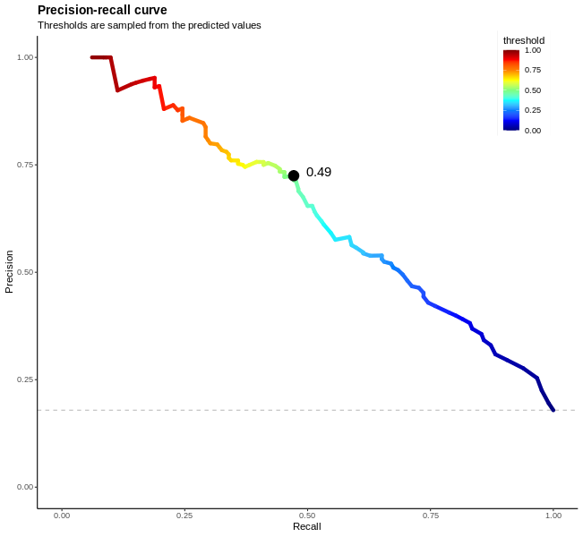
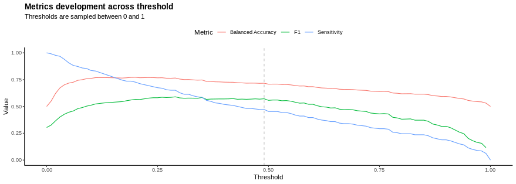
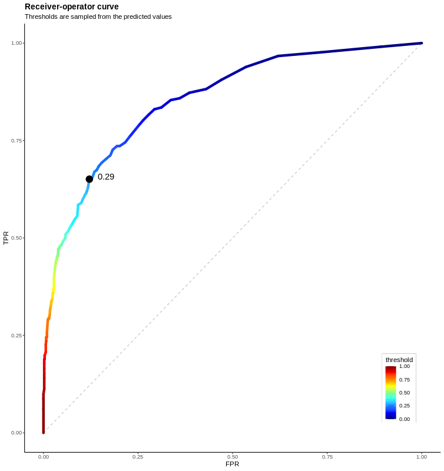
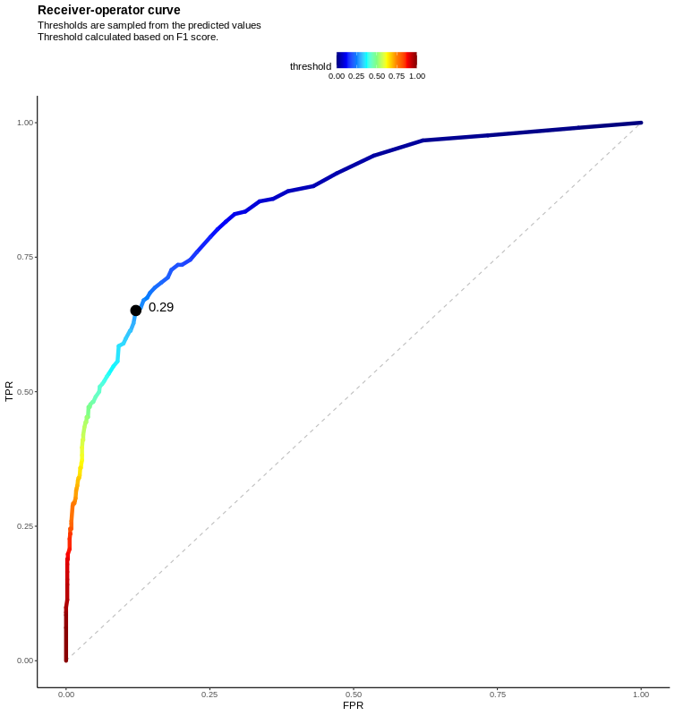

# The `prettyPROC` `R` package

Print pretty PR and ROC curves that also allow for threshold selection in ML classification problems.

## Author

Jana Schor [schor.jana@gmail.com](schor.jana@gmail.com)

## Introduction

In machine learning (ML), the classification problem is a predictive modeling problem that associates a class label with
a given input data sample. To evaluate the predictive power of an ML model, unseen but labeled test data is predicted,
and the predictions are compared to the known truth.

Often this process must happen multiple times during model training and optimization process of the model parameters. If
the model returns a probability of the class association, a value above a certain threshold indicates one class and a
value below the other class. However, this threshold is problem-dependent and not always at 0.5.

With the `prettyPROC` `R` package, I provide functions that calculate all model metrics that might depend on a certain
threshold and generates pretty plots of the results.

* Precision-recall curves
* Receiver-operator curves
* Model metrics vs threshold
* Any model metric against any other model metric w.r.t. to the classifiation threshold.

Within these plots, the best threshold is annotated, labeled, and returned:

|               Precision-Recall curve               |        Receiver operator curve         |
|:--------------------------------------------------:|:--------------------------------------:|
|  |  |

|                   Metrics vs. threshold                   |
|:---------------------------------------------------------:|
|   |

## Installation

Install `R` in at least version 4.0 - or use a respective environment (e.g. `conda` or `mamba`). Start `R` and then you
can install the most up to date version (development) easily with
[devtools](https://github.com/hadley/devtools):

```R
install.packages("devtools")
devtools::install_github("https://github.com/mai00fti/prettyPROC")
```

Once installed, just load the `prettyPROC` package with:

```R
library("prettyPROC")
```

## Example

Load the example data and calcualte the threshold data for 100 thresholds that are evenly distributed between 0 and 1.

```R
# load example data
df <- readr::read_csv(file = "example/predictions.csv")
# calculate all metrics w.r.t. a sampled threshold between 0 and 1
df_tr <- get_threshold_data(truth = df$y_true,
                            prediction = df$y_predicted)
df_tr %>% head()
```

You receive a `tibble::tibble` that you may investigate with the usual `tidyverse` functionality.
You should select one or more metric(s) to calculate the best threshold.

```R
# available metrics are:
df_tr %>% pull(Metric) %>% unique()
```

```
 [1] "Sensitivity"          "Specificity"          "Pos Pred Value"       "Neg Pred Value"      
 [5] "Precision"            "Recall"               "F1"                   "Prevalence"          
 [9] "Detection Rate"       "Detection Prevalence" "Balanced Accuracy"    "TP"                  
[13] "FN"                   "FP"                   "TN"                   "P"                   
[17] "N"                    "N_samples"            "pr_baseline"          "P_pred"              
[21] "N_pred"               "fpr"                  "tpr"                  "tnr"                 
[25] "fnr"                  "roc_auc_tr"           "mcc_tr"              
```

Select MCC, ROC-AUC and F1 score for this example, note that you must add the optimization goal per metric (in this
case
maximize for all metrics).

```R
df_tr_selected <- select_threshold(df = df_tr,
                                   metrics = c("mcc_tr", "roc_auc_tr", "F1"),
                                   optimize = c("max", "max", "max"))
df_tr_selected
```

```
# A tibble: 3 × 3
  Metric     Value threshold
  <chr>      <dbl>     <dbl>
1 mcc_tr     0.517      0.49
2 roc_auc_tr 0.772      0.2 
3 F1         0.590      0.29
```

You may now use one of those thresholds to annotate your curves

```R
tr <- df_tr_selected %>%
  filter(Metric == "F1") %>%
  pull(threshold)
roc <- pretty_roc_curve(df = df_tr, annotate = tr)
show(roc)
```


Since you receive a `ggplot2` object it is easy to adjust a few things, like adding the threshold and its 
respective metric to the title and move the legend to above the plot:

```R
roc +
  ggplot2::labs(subtitle = paste(roc$labels$subtitle,
                                 "Threshold calculated based on F1 score.",
                                 sep = "\n")) + 
  ggplot2::theme(
    legend.position = "top"
  )
```


The other plot functions work in a similar manner.

# License

This program is free software: you can redistribute it and/or modify it under the terms of the GNU General Public
License as published by the Free Software Foundation, either version 3 of the License, or (at your option) any later
version. Details see [LICENCSE](https://github.com/mai00fti/prettyPROC/LICENSE).
